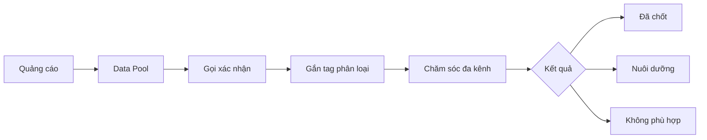

# Bản đồ tổng thể chăm sóc khách hàng

**Chủ sở hữu:** Trưởng phòng Kinh doanh  
**Đối tượng áp dụng:** Marketing, Sale, CSKH, Quản lý  
**Chu kỳ rà soát:** Hàng quý

## Mục tiêu

Biến mọi lead quảng cáo thành hồ sơ có người phụ trách, nhu cầu rõ ràng và bước chăm sóc tiếp theo.

## Đầu vào bắt buộc

- Tên, số điện thoại, email nếu có.
- Nguồn, chiến dịch và sản phẩm quan tâm.
- Thời gian tiếp nhận và nhân viên phụ trách.

## Đầu ra bắt buộc

- Phân khúc, sản phẩm, trạng thái.
- Tóm tắt nhu cầu và trở ngại chính.
- Lịch hẹn tiếp theo và lịch sử tương tác.

## SLA gợi ý

- Lead nóng: gọi trong 5–15 phút.
- Chưa bắt máy: thử lại tối đa 3 lần trong 48 giờ, khác khung giờ.
- Sau mỗi tương tác: cập nhật CRM trong cùng ngày.

