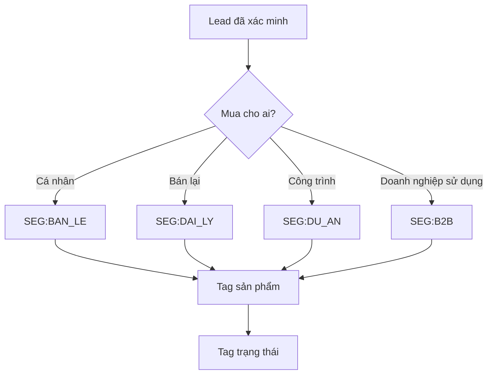

# Chuẩn phân loại và hệ thống tag

**Chủ sở hữu:** CRM Admin  
**Chu kỳ rà soát:** Hàng tháng

Mỗi khách hàng phải có tối thiểu ba lớp tag. Không tạo tag tự do nếu đã có tag chuẩn.

| Lớp | Giá trị chuẩn |
|---|---|
| Đối tượng | `SEG:BAN_LE`, `SEG:DAI_LY`, `SEG:DU_AN`, `SEG:B2B` |
| Sản phẩm | `PROD:SOFA_GIUONG`, `PROD:GIUONG_CONG_THAI_HOC` |
| Trạng thái | `STAGE:MOI`, `STAGE:DA_XAC_NHAN`, `STAGE:DA_TU_VAN`, `STAGE:DA_BAO_GIA`, `STAGE:DANG_THUONG_LUONG`, `STAGE:DA_CHOT`, `STAGE:NUOI_DUONG`, `STAGE:KHONG_PHU_HOP` |

## Cây quyết định

Nhân viên cập nhật trạng thái sau mỗi lần liên hệ và ghi rõ lý do khi chuyển sang nuôi dưỡng hoặc không phù hợp.

