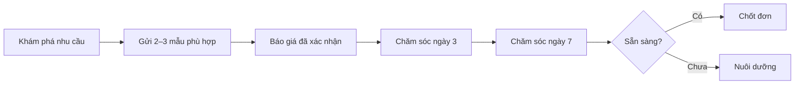

# Hành trình chăm sóc khách mua lẻ

**Chủ sở hữu:** Trưởng nhóm Bán lẻ  
**Đối tượng áp dụng:** Sale bán lẻ, CSKH

## Thông tin cần hỏi

- Sản phẩm, kích thước không gian, công năng mong muốn.
- Khu vực giao lắp, ngân sách, thời gian dự kiến mua.
- Điều khách còn băn khoăn.

## Nội dung được gửi

- Ảnh/video đúng mẫu; kích thước, vật liệu và công năng.
- Báo giá theo nhu cầu đã xác minh.
- Chính sách giao lắp và bảo hành đã được duyệt.

Không gửi dồn dập. Mỗi lần chăm sóc phải bổ sung giá trị mới và kết thúc bằng một bước tiếp theo rõ ràng.

