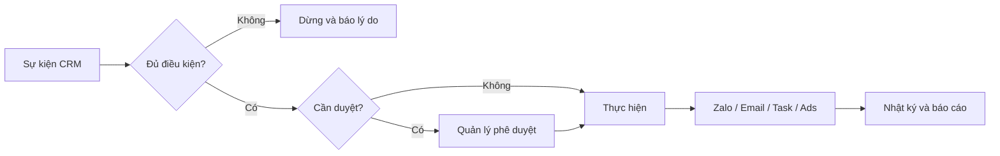

# Quy tắc đa kênh và tự động hóa

**Chủ sở hữu:** CRM Admin và Ban điều hành  
**Chu kỳ rà soát:** Hàng tháng

## Phân vai kênh

- **Cuộc gọi:** xác minh, xử lý vấn đề phức tạp, thống nhất bước tiếp.
- **Zalo OA:** tư vấn, mẫu tin đã duyệt, chăm sóc sau bán đúng chính sách.
- **Email:** catalogue, hồ sơ năng lực, case study, báo giá và tài liệu dài.
- **CRM Task:** không bỏ quên lịch hẹn.
- **Remarketing:** nhắc đúng sản phẩm và loại trừ khách không phù hợp/đã yêu cầu dừng.

## Cổng an toàn

Chỉ tự động hóa khi có căn cứ liên hệ, đúng đối tượng/trạng thái, nội dung đã duyệt, đủ dữ liệu biến, không trùng lịch, có giới hạn tần suất, lưu nhật ký và có cách dừng.

