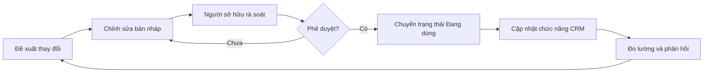

# Bộ não doanh nghiệp SmartFurni

Đây là bộ tài liệu nguồn cho quy trình chăm sóc khách hàng và các chức năng CRM được xây dựng từ quy trình đó. Bản đang áp dụng trong CRM phải ở trạng thái **Đang dùng** và có chủ sở hữu chịu trách nhiệm.

## Danh mục tài liệu

1. [Bản đồ tổng thể chăm sóc khách hàng](./01-ban-do-cham-soc-khach-hang.md)
2. [Chuẩn phân loại và hệ thống tag](./02-chuan-phan-loai-va-tag.md)
3. [Hành trình khách mua lẻ](./03-hanh-trinh-khach-mua-le.md)
4. [Hành trình đại lý, dự án và B2B](./04-hanh-trinh-b2b.md)
5. [Quy tắc đa kênh và tự động hóa](./05-da-kenh-va-tu-dong-hoa.md)

## Quy trình thay đổi tài liệu

## Nguyên tắc code từ tài liệu

- Mỗi chức năng mới phải dẫn chiếu tài liệu và phiên bản đang áp dụng.
- Phải xác định đầu vào, đầu ra, người chịu trách nhiệm và điểm phê duyệt.
- Không tự động gửi, sửa hoặc xóa dữ liệu nếu tài liệu chưa quy định rõ quyền và cổng an toàn.
- Khi tài liệu thay đổi, tạo phiên bản mới; không ghi đè mất lịch sử.

